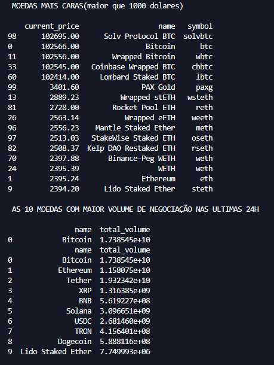

  
Este é um mini projeto de análise de dados de criptomoedas utilizando a [API pública da CoinGecko](https://www.coingecko.com/en/api).  
O objetivo é praticar consumo de API, manipulação de JSON e tratamento de dados com Python + Pandas.

##  Funcionalidades

- Lista moedas com preço acima de 1000 USD
- Mostra as 10 moedas com maior volume de negociação nas últimas 24h
- Exibe moedas que subiram mais de 5% nas últimas 24h
- Exporta cada análise para arquivos CSV

##  Tecnologias utilizadas

- Python 3
- requests
- pandas

##  Como executar

1 - instale as bibliotecas
`py -m install requests pandas`

2 - rode o arquivo 
`main.py`

3 - veja o resultado nos arquivos gerados ou no terminal.

made by @urtTarzan on github
